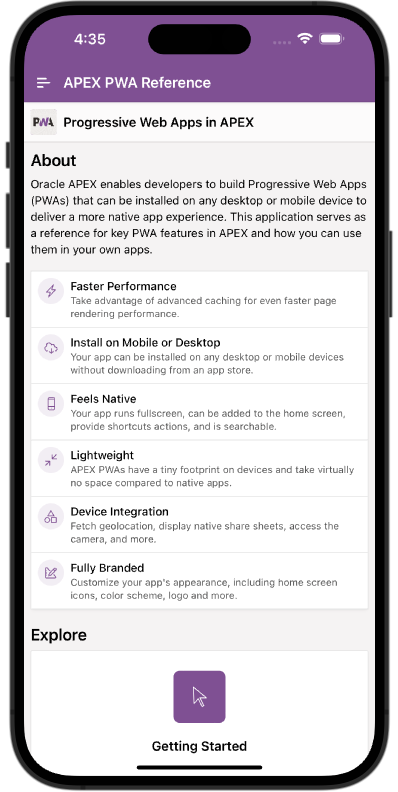

# APEX PWA Reference



APEX PWA Reference is an Oracle APEX sample application for learning how
Progressive Web App features work in APEX. The app is itself configured as an
installable PWA and acts as a hands-on reference for PWA setup, installation,
appearance, app icons, shortcuts, service workers, push notifications,
geolocation, Web Share, persistent authentication, and offline fallback pages.

This repository contains a split APEX application export in APEXlang `.apx`
format. The application, pages, shared components, supporting objects, workspace
components, and static files are stored as separate source files so the app can
be reviewed and versioned in Git.

## Highlights

- Installable Oracle APEX Progressive Web App.
- PWA app description, theme color, screenshots, and app shortcuts configured in
  `application.apx`.
- Custom manifest override that sets the PWA short name to `APEX PWA`.
- Navigation menu with feature-focused documentation pages.
- Live browser-feature demos for Geolocation and Web Share.
- Push notification guidance covering subscriptions, APEX views, the native page
  process, and the `apex_pwa` API.
- Service worker and offline fallback reference material.
- Bundled static assets for app icons, shortcut icons, screenshots, and
  platform-specific examples.

## Application Metadata

| Property | Value |
| --- | --- |
| Application name | APEX PWA Reference |
| Application alias | `APEX-PWA-REFERENCE` |
| Export format | APEXlang split export |
| APEXlang metadata version | `26.1.0+3102` |
| Application version | `26.1.0` |
| Default deployment app id | `37734` |
| Theme | Universal Theme 42, `ut-26.1` |
| Theme style | APEX PWA |
| Authentication | Oracle APEX Accounts |
| PWA theme color | `#7c5095` |

## Functionality

The app is organized as a reference guide with focused pages:

| Page | Name | Purpose |
| --- | --- | --- |
| 1 | Home | Overview of APEX PWA benefits and capabilities. |
| 2 | Appearance | Display modes, theme color, iOS status bar, orientation, and manifest options. |
| 3 | Push Notifications | Push setup, device subscription, sending options, APEX views, queueing, and troubleshooting. |
| 4 | App Icon | App icon guidance and PWA shortcut configuration examples. |
| 5 | Service Worker | Default APEX service worker behavior and hook extension points. |
| 6 | Getting Started | Steps for creating a new PWA or enabling PWA support in an existing APEX app. |
| 7 | Installation | Desktop, Android, and iOS installation flows, plus screenshots and descriptions. |
| 8 | Geolocation | Demo and setup notes for the `Get Current Position` dynamic action. |
| 9 | Web Share | Demo and setup notes for the native `Share` dynamic action and page meta tags. |
| 10 | Always Signed In | Persistent authentication behavior for installed PWAs. |
| 11 | Offline Fallback | Custom offline fallback page guidance and preview. |
| 20 | Advanced | Entry point for advanced PWA topics. |
| 100 | FAQ | Frequently asked questions about APEX PWAs. |
| 101 | Roadmap | PWA feature roadmap and release history content. |
| 1000 | A PWA Page | Minimal public page used as a simple PWA target/example. |

## Repository Layout

```text
.
|-- .apex/
|   `-- apexlang.json
|-- application.apx
|-- deployments/
|   `-- default.json
|-- page-groups.apx
|-- pages/
|-- shared-components/
|   |-- static-files/
|   |-- themes/
|   `-- *.apx
|-- supporting-objects/
|-- workspace-components/
`-- README.md
```

Notable directories:

- `pages/` contains the individual page exports.
- `shared-components/static-files/` contains images used by the reference app,
  including PWA screenshots, shortcut icons, app icons, and instructional
  screenshots.
- `shared-components/themes/universal-theme/` contains the Universal Theme
  export and custom APEX PWA theme style.
- `supporting-objects/` contains supporting-object metadata. There are no custom
  install scripts or schema objects in this export.
- `deployments/default.json` contains the default deployment metadata,
  including the exported app id.

## Requirements

- Oracle APEX version compatible with this export, ideally APEX 26.1 or later.
- An APEX workspace where the application can be imported.
- A browser and operating system that support the PWA feature being tested.
- HTTPS for most production PWA behavior, especially installability, service
  workers, geolocation, Web Share, and push notifications.
- For push notifications, valid APEX push credentials and outbound network/ACL
  configuration from the database environment.

## Importing The App

Import this repository as an APEX application export using tooling that supports
APEXlang split `.apx` applications. The root candidate app consists of
`application.apx`, `pages/`, `shared-components/`, `supporting-objects/`,
`workspace-components/`, `page-groups.apx`, `.apex/`, and `deployments/`.

After import:

1. Confirm the application id and alias are appropriate for your workspace.
2. Review the Progressive Web App settings in Shared Components.
3. Regenerate push notification credentials if you plan to test push delivery.
4. Run the app over HTTPS when testing installability or device APIs.
5. Test platform-specific features on the target browsers and devices, since PWA
   support differs by browser, operating system, and installation state.

## Development Notes

- The navigation bar includes an `Install App` entry that triggers
  `#action$a-pwa-install`.
- PWA shortcuts are configured for Home, Getting Started, Installation,
  Appearance, App Icon, Geolocation, Web Share, Always Signed In, and FAQ.
- The Geolocation page includes a `Geolocate` button wired to the native
  `getCurrentPosition` dynamic action.
- The Web Share page includes a `Share` button wired to the native `share`
  dynamic action and hides the demo when `navigator.canShare` is unavailable.
- Push notification content references `apex_appl_push_subscriptions`,
  `apex_push_notifications_queue`, `apex_pwa.send_push_notification`, and
  `apex_pwa.push_queue`.
- The app uses APEX Accounts authentication and does not include custom database
  tables, package specs, package bodies, or seed data.

## License

The application export includes an Oracle copyright banner and references the
Universal Permissive License v1.0. Add a repository-level `LICENSE` file if you
want GitHub to detect and display the license automatically.
